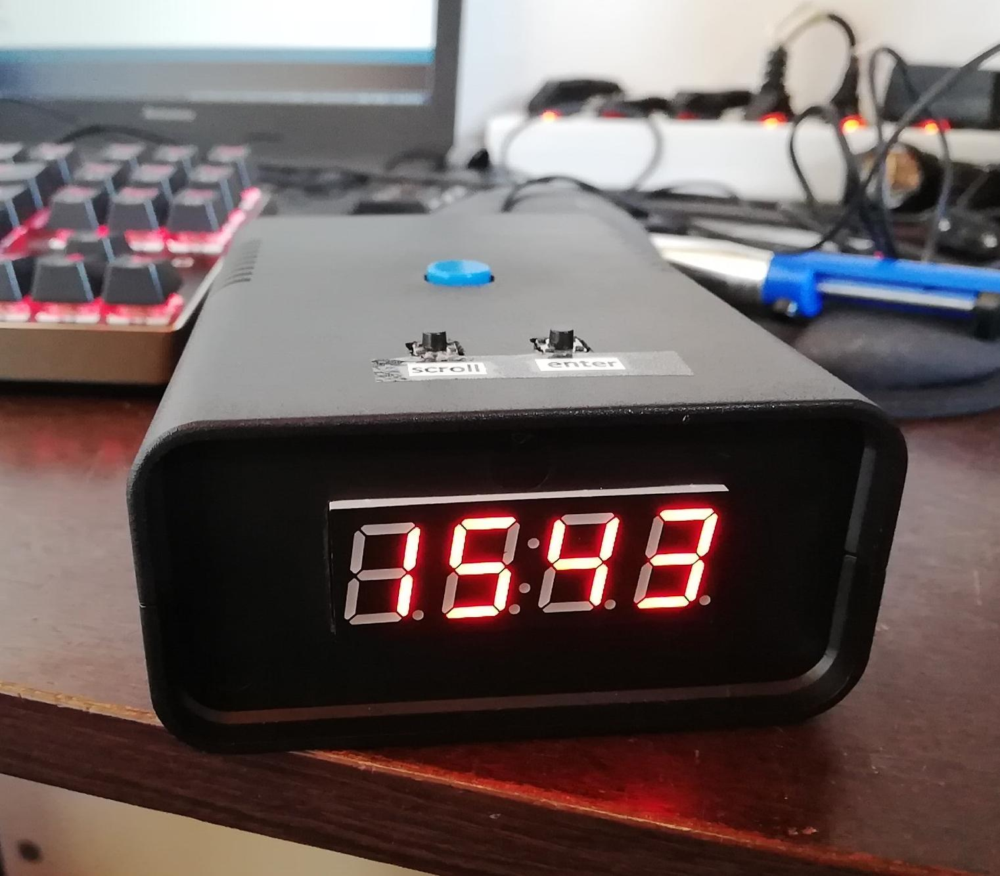

# Clock-alarm
Arduino code for clock and alarm using TM1637 7 segment display and DS3231 RTC module

To set the correct time hold down the scroll button until the display clears. Device will enter 'Time Setup' mode where you edit digit by digit. Pressing down the scroll button will change current number. Press enter to accept and move on to the next digit.

You can set alarm the same way, the only difference is that you enter 'Alarm mode' by holding down enter button.

Notes: 
 - In 'Normal mode' two middle dots will flash periodically.
 - Alarm time is currently not stored in EEPROM, so every time you turn the device OFF/ON alarm will be set to 00:00h by default.
 - When the alarm turns on, you can turn it off using the big blue button.

